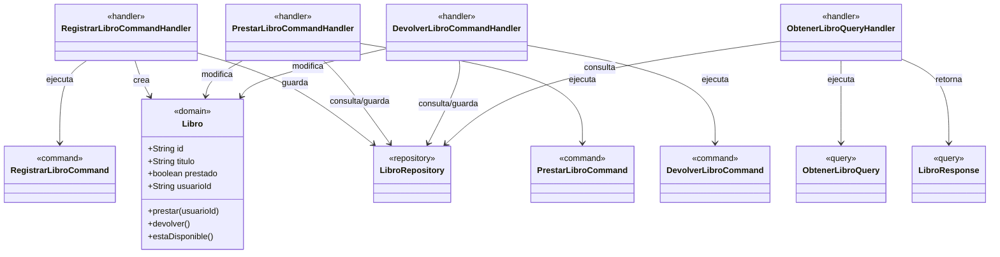
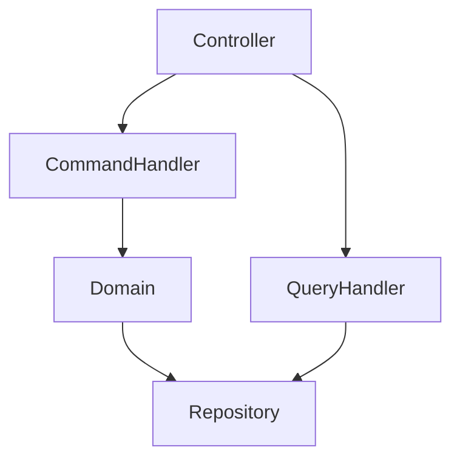

# Demo patrón CQRS Biblioteca 

# Grupo 9. Integrantes:
Angie Lorena Prieto Dominguez

Rosemberg Porras Mancilla

Ivan Felipe Vera Triana

Juan Felipe Gonzalez Ortiz

Leonardo Pérez Ramírez

---


## Descripción

Este proyecto es una demostración académica de la arquitectura CQRS (Command Query Responsibility Segregation) aplicada sobre Clean Architecture usando Spring Boot. El objetivo es mostrar de forma didáctica cómo separar completamente el modelo de escritura (commands) del modelo de lectura (queries) en un sistema de gestión de biblioteca.

---

## ¿Qué es CQRS?

CQRS es un patrón arquitectónico que propone separar las operaciones de escritura (Command) de las operaciones de lectura (Query) en un sistema. Esto permite que cada lado evolucione de manera independiente, optimizando la lógica de negocio y la consulta de datos.

---

## ¿Por qué CQRS en este proyecto?

- Permite demostrar la separación de responsabilidades de forma clara.
- Facilita la explicación académica de los flujos de modificación y consulta.
- Mejora la mantenibilidad y escalabilidad del sistema.
- Evidencia cómo la lógica de negocio vive en el dominio y no en los controladores.

---

## Estructura del Proyecto

```
com.biblioteca.cqrs
├── application
│   ├── command        # DTOs de escritura
│   ├── query          # DTOs de consulta
│   └── handler        # Orquestadores de comandos y queries
├── domain
│   └── Libro          # Lógica de negocio y entidades del dominio
└── infrastructure
    ├── http           # Adaptador HTTP (controllers REST)
    └── repository     # Repositorios en memoria (HashMap)

```

### Domain

Contiene la lógica de negocio pura. Ejemplo: métodos prestar(), devolver(), estaDisponible() en la entidad Libro.

### Application

Contiene los DTOs de Command y Query, y los handlers que orquestan el flujo de cada operación.

### Infrastructure

Implementa los repositorios en memoria, sin lógica de negocio, solo almacenamiento.

### HTTP Adapter

Expone los endpoints REST, delegando la lógica a los handlers. No contiene lógica de negocio.

---

## Flujo de Ejecución

### Registrar libro

1. Controller recibe RegistrarLibroCommand.
2. Handler crea la entidad Libro y la guarda en el repositorio.
3. Logging: [COMMAND] → [DOMAIN]

### Prestar libro

1. Controller recibe PrestarLibroCommand.
2. Handler busca el libro, llama prestar() y guarda el estado.
3. Logging: [COMMAND] → [DOMAIN]

### Devolver libro

1. Controller recibe DevolverLibroCommand.
2. Handler busca el libro, llama devolver() y guarda el estado.
3. Logging: [COMMAND] → [DOMAIN]

### Consultar libro

1. Controller recibe ObtenerLibroQuery.
2. Handler busca el libro y retorna un DTO de lectura.
3. Logging: [QUERY]

---

## Separación entre Command y Query

- Los Commands modifican el estado del sistema.
- Los Queries solo leen datos, sin modificar el estado.
- Cada handler tiene una responsabilidad única.
- No se mezclan flujos de lectura y escritura.

---

## Comparación CQRS vs CRUD tradicional

| CQRS                        | CRUD tradicional           |
|-----------------------------|---------------------------|
| Separación Command/Query    | Métodos combinados        |
| Lógica de negocio en dominio| Lógica en controller      |
| Handlers orquestan          | Controladores gestionan   |
| Escalabilidad didáctica     | Simplicidad, menos clara  |

---

## Diagrama de Clases (Mermaid)



---

## Diagrama de Flujo (Mermaid)



---

## Ejemplo de logs reales

```
[COMMAND] Ejecutando RegistrarLibroCommand: 123 - Clean Architecture
[DOMAIN] Libro marcado como prestado: 123 por usuario 456
[COMMAND] Ejecutando DevolverLibroCommand para libro 123
[DOMAIN] Libro marcado como devuelto: 123
[QUERY] Consultando libro 123
```

---
# Version 2: Contenerizacion, Kubernetes, Helm y ArgoCD

Esta version del proyecto documenta el laboratorio de despliegue del microservicio CQRS usando:
- Docker para empaquetado.
- Minikube como cluster Kubernetes local.
- Helm para plantillas y despliegue parametrizable.
- ArgoCD para GitOps (sin incluir aun la fase de CI automatizado).

## 1. Prerrequisitos

- Docker Desktop instalado y corriendo.
- Homebrew.
- `kubectl`, `minikube`, `helm`.
- Cuenta en Docker Hub.

Instalaciones usadas:

```bash
brew install kubectl
brew install minikube
brew install helm
```

## 2. Dockerizacion de la aplicacion

### 2.1 Build y ejecucion local

```bash
docker build -t cqrs-example:local .
docker run --rm -p 8080:8080 cqrs-example:local
```

### 2.2 Publicacion en Docker Hub

```bash
docker login
docker tag cqrs-example:local lordrosem/cqrs-example:dev
docker push lordrosem/cqrs-example:dev
```

## 3. Kubernetes local con Minikube

### 3.1 Levantar cluster

```bash
minikube start --driver=docker --cpus=2 --memory=4096
```

Notas:
- Este comando crea/actualiza el contexto en `~/.kube/config`.
- `kubectl` queda apuntando al cluster local `minikube`.

### 3.2 Verificaciones iniciales

```bash
kubectl get nodes -o wide
minikube addons enable metrics-server
minikube dashboard
```

## 4. Helm chart del microservicio

Estructura base creada:

```text
helm/cqrs-example
├── Chart.yaml
├── values.yaml
├── values-dev.yaml
└── templates
    ├── _helpers.tpl
    ├── deployment.yaml
    ├── service.yaml
    └── configmap.yaml
```

Resumen:
- `Chart.yaml`: metadatos del chart.
- `values.yaml`: valores base.
- `values-dev.yaml`: override para entorno dev.
- `templates/`: manifiestos Kubernetes parametrizados.

## 5. Despliegue con Helm

### 5.1 Validacion de chart

```bash
helm lint helm/cqrs-example
helm template cqrs-demo helm/cqrs-example \
  -f helm/cqrs-example/values.yaml \
  -f helm/cqrs-example/values-dev.yaml
```

### 5.2 Instalacion/actualizacion

```bash
helm upgrade --install cqrs-demo helm/cqrs-example \
  -f helm/cqrs-example/values.yaml \
  -f helm/cqrs-example/values-dev.yaml \
  --namespace cqrs-dev \
  --create-namespace
```

### 5.3 Verificacion de despliegue

```bash
helm list -n cqrs-dev
helm status cqrs-demo -n cqrs-dev
kubectl get pods -n cqrs-dev -o wide
kubectl get all -n cqrs-dev
kubectl logs -n cqrs-dev deploy/cqrs-example --tail=50
```

## 6. Acceso a la aplicacion

Como se usa Minikube con driver Docker en macOS, se expone con:

```bash
minikube service cqrs-example -n cqrs-dev --url
```

Luego se prueba, por ejemplo:

```bash
curl -i http://127.0.0.1:<puerto>/libros/1
```

Una respuesta `404` con mensaje de negocio (libro no encontrado) confirma que la app esta corriendo correctamente.

## 7. Flujo manual de redeploy (simulando CI)

Cada cambio de aplicacion siguio este flujo:

```bash
docker build -t cqrs-example:local .
docker tag cqrs-example:local lordrosem/cqrs-example:dev
docker push lordrosem/cqrs-example:dev
helm upgrade --install cqrs-demo helm/cqrs-example \
  -f helm/cqrs-example/values-dev.yaml \
  -n cqrs-dev
kubectl get pods -n cqrs-dev
```

Recomendacion:
- usar tags versionados (`dev-001`, `dev-002`, etc.) en lugar de reutilizar siempre `dev`.

## 8. Implementacion de ArgoCD (Fase 2)

### 8.1 Instalacion

```bash
kubectl create namespace argocd
kubectl apply --server-side -n argocd \
  -f https://raw.githubusercontent.com/argoproj/argo-cd/stable/manifests/install.yaml
```

### 8.2 Crear Application del proyecto

Archivo usado: `argocd/application-cqrs.yaml`

```bash
kubectl apply -f argocd/application-cqrs.yaml
```

### 8.3 Verificacion

```bash
kubectl get pods -n argocd
kubectl get applications -n argocd
kubectl describe application cqrs-example -n argocd
```

## 9. Acceso local a ArgoCD UI

```bash
kubectl port-forward svc/argocd-server -n argocd 8081:443
```

Abrir:
- `https://localhost:8081`

Password inicial:

```bash
kubectl -n argocd get secret argocd-initial-admin-secret \
  -o jsonpath="{.data.password}" | base64 -d; echo
```

## 10. Estado actual del laboratorio

- Fase 1 (Docker + Kubernetes + Helm): completada y validada.
- Fase 2 (ArgoCD base): instalada y configurada.
- Fase 3 (CI con GitHub Actions y actualizacion automatica de tag en Helm): pendiente para siguiente iteracion.
